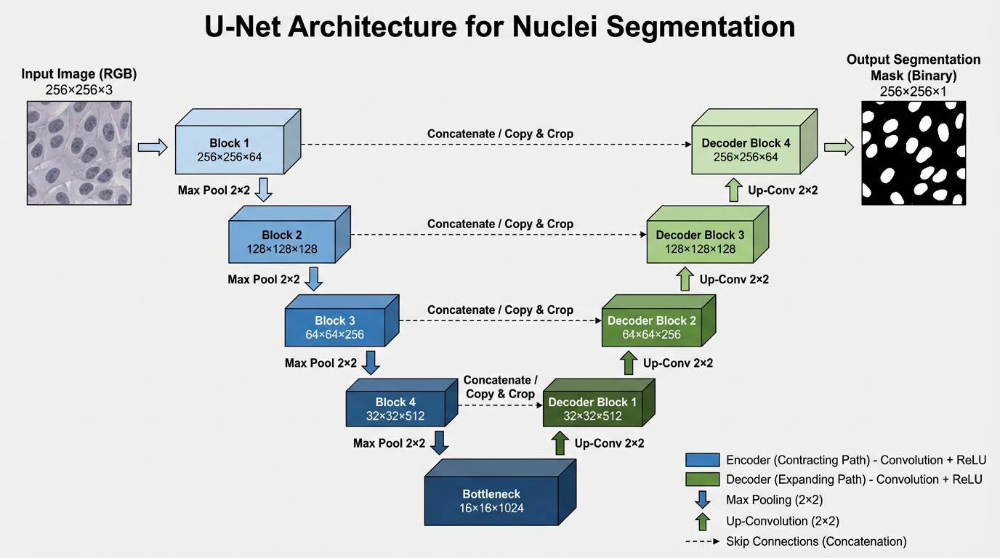
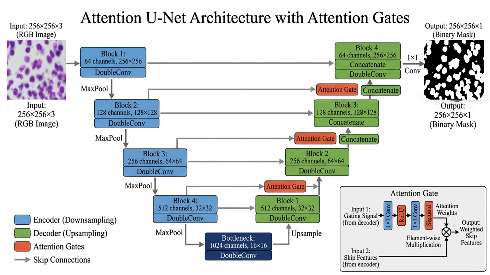
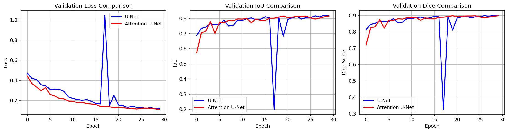

<div align="center">

# 🔬 Nuclei Segmentation: U-Net vs Attention U-Net

[](https://python.org)
[](https://pytorch.org)
[](https://kaggle.com)
[](LICENSE)

> **Automated cell nuclei segmentation in fluorescence microscopy images using deep learning — achieving 90.08% Dice score in under 30 minutes of training.**

</div>
---

## 📌 Overview

This project benchmarks two encoder-decoder architectures — **U-Net** and **Attention U-Net** — on the [2018 Data Science Bowl](https://www.kaggle.com/c/data-science-bowl-2018) dataset for biomedical instance segmentation of cell nuclei.

| Model | Parameters | Val IoU | Val Dice | Val Loss |
|-------|-----------|---------|----------|----------|
| **U-Net** | 13.4M | **82.07%** | **90.08%** | 0.1188 |
| Attention U-Net | 13.7M | 81.52% | 89.74% | **0.1097** |

> **Key finding:** On clean, well-stained microscopy data, standard U-Net skip connections are sufficient. Attention gates add model complexity without meaningful segmentation gain — a dataset-dependent insight with direct implications for microfluidic cell analysis pipelines.

---

## 🎯 Motivation

Automated cell segmentation is a critical bottleneck in:
- High-throughput drug screening
- Cancer pathology and diagnosis
- Microfluidic single-cell sorting and analysis

Manual annotation is slow, expensive, and inconsistent. This project explores whether architectural complexity (attention mechanisms) yields measurable improvement over the classical U-Net baseline on clean fluorescence microscopy data.

---

## 🗂️ Dataset

**Source:** Kaggle 2018 Data Science Bowl — Broad Institute BBBC038v1

| Property | Value |
|----------|-------|
| Total training images | 670 |
| Train / Validation split | 536 / 134 (80/20) |
| Resized resolution | 256 × 256 |
| Mean nuclei per image | 38.8 |
| Total annotated instances | ~26,000 |
| Image variability | Brightfield, fluorescence, H&E staining |

The dataset spans diverse imaging conditions — varying stains, resolutions, cell densities (1–206 nuclei/image), and tissue types — making it a robust benchmark for generalization.

---

## 🏗️ Model Architectures

### U-Net *(Ronneberger et al., MICCAI 2015)*
A symmetric encoder-decoder with skip connections that preserve spatial detail lost during downsampling. The de facto standard for biomedical image segmentation.

| 

### Attention U-Net *(Oktay et al., arXiv 2018)*
Extends U-Net with **soft attention gates** on skip connections, allowing the model to suppress irrelevant background activations and focus on target structures. Most beneficial in cluttered or noisy imaging scenarios.

| 

---

## 📊 Results

### Quantitative Comparison

| Metric | U-Net | Attention U-Net | Δ |
|--------|-------|-----------------|---|
| Val Loss | 0.1188 | **0.1097** | -0.0091 |
| Val IoU | **0.8207** | 0.8152 | -0.0055 |
| Val Dice | **0.9008** | 0.8974 | -0.0034 |
| Epochs | 30 | 30 | — |

---

### Qualitative Analysis

| ![sample predictions(results/figures/attention_unet_predictions.png) 

---

### Training Curves



---

## 💡 Discussion

### Why U-Net outperforms Attention U-Net on this dataset

| Factor | Explanation |
|--------|-------------|
| Clean backgrounds | Skip connections already capture sufficient spatial context |
| High contrast staining | No irrelevant activations for attention to suppress |
| Simple foreground/background | Attention complexity adds parameters without proportional benefit |

### When Attention U-Net is the better choice

| Scenario | Recommendation |
|----------|---------------|
| Noisy backgrounds (autofluorescence, debris) | ✅ Use Attention U-Net |
| Low contrast or weak signals | ✅ Use Attention U-Net |
| Overlapping or densely packed cells | ✅ Use Attention U-Net |
| Multiple imaging modalities | ✅ Use Attention U-Net |
| Clean, well-stained samples | U-Net is sufficient |

> Both models achieve near-identical segmentation quality (within 1%). Model selection should be driven by **dataset characteristics**, not architectural novelty.

---

## 🚀 Quick Start

### 1. Clone & Install

```bash
git clone https://github.com/asadshahnawaz20/cell-segmentation-deep-learning.git
cd nuclei-segmentation
pip install -r requirements.txt
```

### 2. Download Dataset

```bash
# Via Kaggle API
kaggle competitions download -c data-science-bowl-2018
```

Or download manually from [Kaggle](https://www.kaggle.com/c/data-science-bowl-2018/data).

### 3. Run Notebooks

| Notebook | Description | Runtime |
|----------|-------------|---------|
| `01_data_exploration.ipynb` | Data loading, EDA, preprocessing, split creation | ~5 min |
| `02_model_training.ipynb` | Training pipeline for both models with callbacks | ~30 min each |

---

## 📁 Project Structure

```
nuclei-segmentation/
│
├── notebooks/
│   ├── 01_data_exploration.ipynb       # EDA, preprocessing, dataset splits
│   └── 02_model_training.ipynb         # Full training pipeline, evaluation
│
├── results/
│   ├── figures/                         # All generated visualizations
│   │   ├── dataset_samples.png
│   │   ├── dataset_distributions.png
│   │   ├── model_comparison.png
│   │   ├── unet_predictions.png
│   │   └── attention_unet_predictions.png
│   └── metrics/                         # Training history (JSON)
│
├── requirements.txt
├── README.md
└── LICENSE
```

---

## 🔮 Future Work

- **Instance segmentation** — separate touching nuclei via StarDist or Cellpose
- **3D volumetric segmentation** — extend to z-stack microscopy for spheroid analysis
- **Active learning** — reduce annotation cost with uncertainty sampling
- **Lightweight deployment** — optimize for real-time microfluidic cell sorting pipelines

---

## 📄 References

- Ronneberger, O., Fischer, P., & Brox, T. (2015). *U-Net: Convolutional Networks for Biomedical Image Segmentation.* MICCAI.
- Oktay, O., et al. (2018). *Attention U-Net: Learning Where to Look for the Pancreas.* arXiv:1804.03999.
- Caicedo, J.C., et al. (2019). *Nucleus segmentation across imaging experiments: the 2018 Data Science Bowl.* Nature Methods.

---

## 📄 License

MIT License — free for academic and commercial use.

---

## 🙏 Acknowledgments

- [Kaggle](https://kaggle.com) & [Broad Institute](https://www.broadinstitute.org/) for the DSB2018 dataset
- Original authors of U-Net and Attention U-Net

---

<div align="center">

**Asad Channa**
[](https://github.com/asadshahnawaz20)
[](https://www.linkedin.com/in/asad-channa-5bb6922a9)
[](mailto:drasadchanna657@gmail.com)


⭐ **Star this repo if it helped you!** ⭐


</div>


